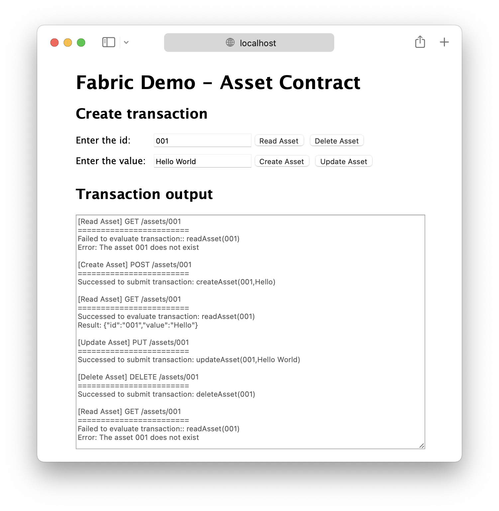

# Fabric Demo



## Requirements

- Ubuntu 20.04
- Docker
- Node.js

## Usage

To start the demo, run the following command:

```
./run.sh
```

It will start the Hyperledger Fabric network and then start the demo web application.
